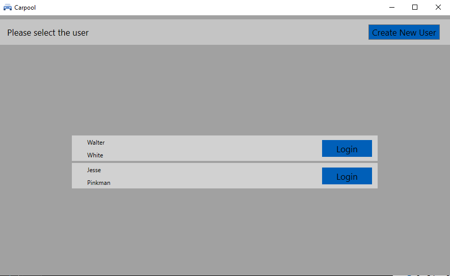
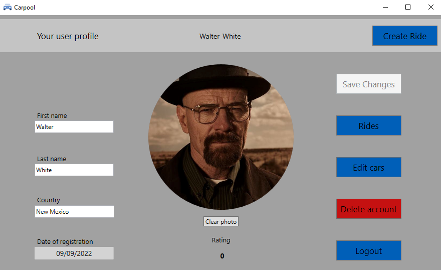
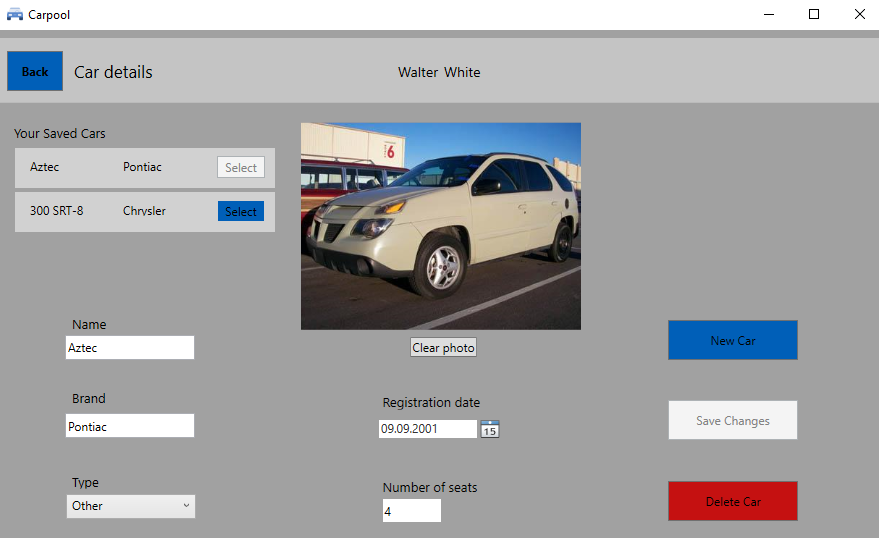
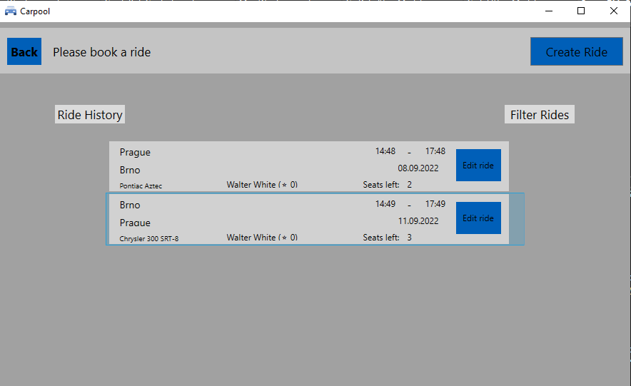
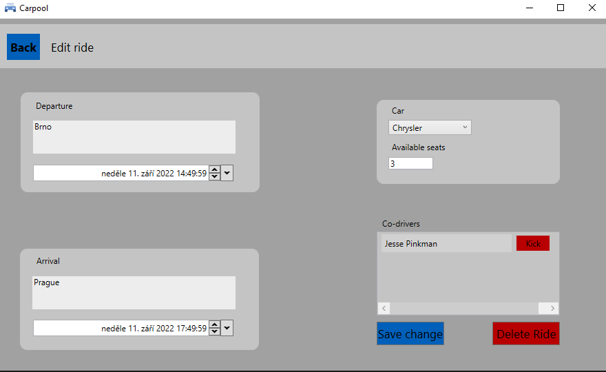
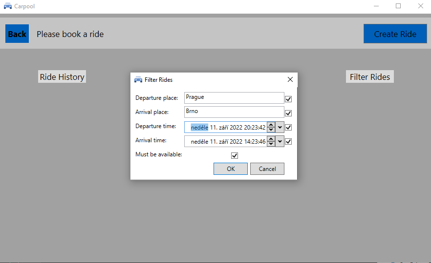
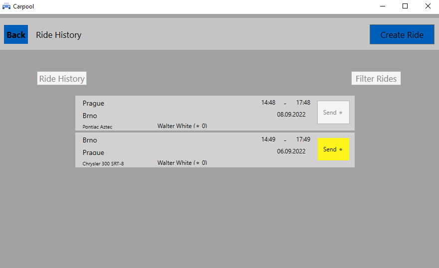

# ICS project - Carpool

## About project
It is app made for carpooling. You can created user, log in as him, save details about your cars and share you rides with other users. All information about entities are persistent! But sorry, still only in local DB... So its purpose its just a demonstration.

Project is made with Visual Studio, WPF and entity framework (it is written in C#).

Originally it was developed with Azure DevOps.

For details see https://github.com/nesfit/ICS/tree/master/Project

## Structure
- `docs` - folder with ER diagram, mockup, wireframes - design of future app (1. submission)
    + `mockup.pdf`
    + `wireframe.pdf`
    + `erdiagram.pdf`
- `Carpool` - folder with App
    + `Carpool.BL` - business layer (2. submission)
    + `Carpool.BL.Tests` - facade tests (2. submission)
    + `Carpool.Common` - enums used in app and other auxiliary functions and methods
    + `Carpool.Common.Tests` - auxiliory functions for tests
    + `Carpool.DAL` - DAL of aplication (declaration of entities, seeds, UOW, ...) (1. submission)
    + `Carpool.DAL.Tests` - test of DAL

## Extensions
Ride history and sending of "stars" to driver.

## Authors
- Radek Marek
- Vojtěch Dvořák
- Tomáš Dvořák
- Alexandr Jaroš
- Juraj Dedič

## References
- All used sources are mentioned in corresponding files
- We mostly used design patterns used in example project CookBook https://github.com/nesfit/ICS/tree/master/src/CookBook (it was completely allowed)
